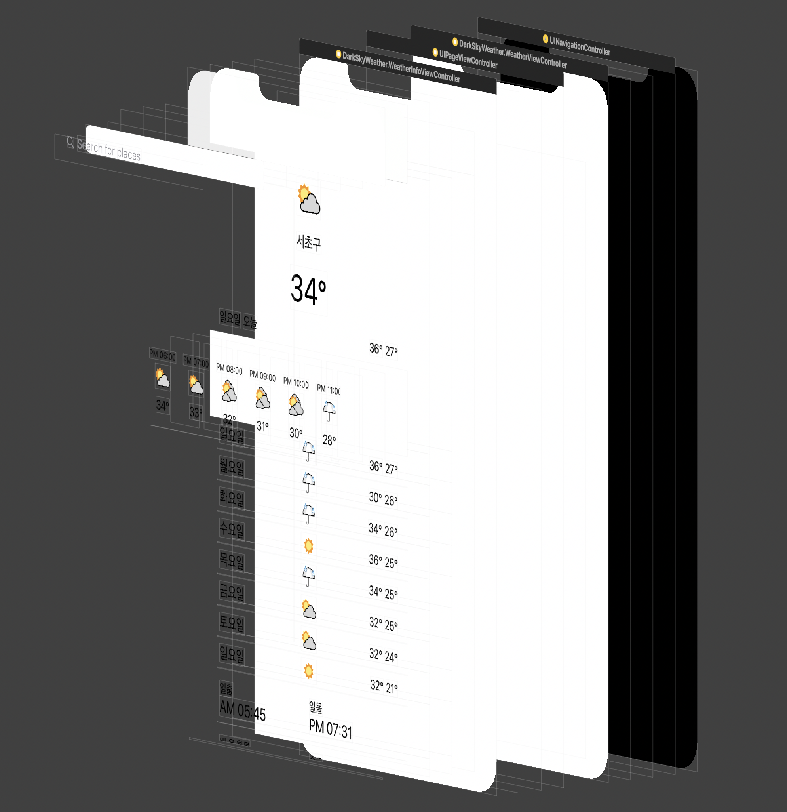

# kakaopay

Dark Sky API를 이용해서 Apple 기본 날씨앱과 유사한 기능셋을 구현하였습니다.


### 개발환경
- Xcode 10.2.1
- Swift 5.0
- 최소버전 10.0

### 개발스펙
- Clean Architecture(VIP)
- RxSwift
- CoreData
- Storyboard, Autolayout

### UI 스택 구조
```
UINaivationController
 ㄴ UIViewController
    ㄴ UIPageViewController
       ㄴ UIViewController
                .
                .
                .
    ㄴ UISearchController
```


